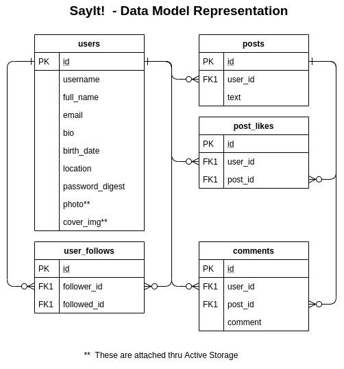

<h1 align="center">[Rails] Capstone Project / Twitter Redesign </h1>
<p>
  
  <a href="#" target="_blank">
    
  </a>
  <a href="https://twitter.com/ae_cordova" target="_blank">
    
  </a>
</p>

___
## Description of the project 

The purpose of this project is to practice Rails acquired knowledge by building an app called SayIt Where a user can Sign in, share, read, like or comment Posts and follow users to see their posts in this timeline.

<h3 align="center">Data Model Representation</h3>
<p align="center">
  
</p>


### ⭐️ Built with
* Ruby on Rails 6
* HTML5/CSS3/Sass
* JQuery
* Capybara
* RSpec

### Dev Environment Requirements:
* Ruby needs to be installed to run the code, check [here](https://www.ruby-lang.org/en/documentation/installation/) for further steps


### ⭐️ Running the code

#### Live Version:

<!-- You can find a live running version of this app on the following link: [Stay In Touch](https://mighty-basin-95377.herokuapp.com/users/sign_in) -->

#### Instructions for running on local environment:

1. Clone the repo

2. Navigate to the root directory

3. Run bundle install to ensure all the needed gems are installed:
    ```
    $ bundle install
    ```
3. Run Yarn Install
    ```
    $ yarn install --check-files
    ```
3. Migrate the DB
    ```
    $ rails db:migrate
    ```
3. Run Rails Server
    ```
    $ rails server
    ```
3. Open localhost:3000 on a browser to get to the home page
    ```
    https://localhost:3000
    ```
### ⭐️ How it works

1. Go to the Home Page and click on the  Sign Up button

2. Fill up your information, name, email, password and confirmation are required.

3. The app will automatically sing you in. (If you already have signed up previously, Click on the Login link on the nav bar, and fill up your email and password.)

4. Once you're logged in the rest of the options appear, 
   
   * On the right side of the page, you will see recommendations of users to follow, click on the follow button so you can start seeing his posts on your home screen.  
   
   * To see your profile, click on the Profile Option in the NavBar, there, you will see your info, your posts and stats 

   * To create a Post, go to your home page, fill up the post information and press the button.

   * To comment on a Post, click on the comment icon below the post, fill up the comment field and press the button. You can display all the comments with the caret down button next to the comment counter.

   * To Like a post, click on the heart button below post. Click again to un-like it.
   
   * Newest posts will appear first

<!-- CONTRIBUTING -->
## Contributing

Any contributions you make are **greatly appreciated**.

1. Fork the Project
2. Create your Feature Branch (`git checkout -b feature/AmazingFeature`)
3. Commit your Changes (`git commit -m 'Add some AmazingFeature'`)
4. Push to the Branch (`git push origin feature/AmazingFeature`)
5. Open a Pull Request


## Authors

👤 **Angel Cordova** 
* Github: [@aecordova](https://github.com/https:\/\/github.com\/aecordova)  
